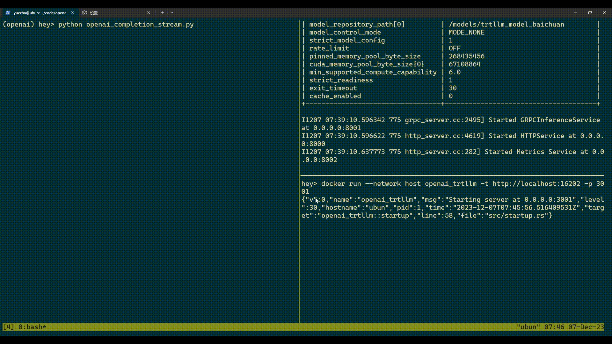
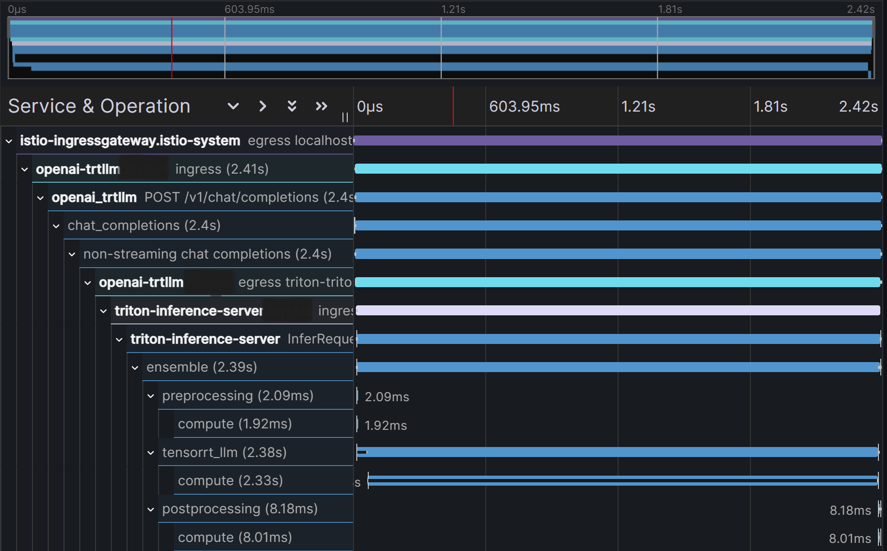

# openai_trtllm - OpenAI-compatible API for TensorRT-LLM

Provide an OpenAI-compatible API for [TensorRT-LLM](https://github.com/NVIDIA/TensorRT-LLM)
and [NVIDIA Triton Inference Server](https://github.com/triton-inference-server/tensorrtllm_backend), which allows you
to integrate with [langchain](https://github.com/langchain-ai/langchain)

## Quick overview



## Get started

### Prerequisites

Make sure you have built your own TensorRT LLM engine following
the [tensorrtllm_backend tutorial](https://github.com/triton-inference-server/tensorrtllm_backend#using-the-tensorrt-llm-backend).
The final model repository should look like
the [official example](https://github.com/triton-inference-server/tensorrtllm_backend/tree/v0.9.0/all_models/inflight_batcher_llm).

**Notice: to enable streaming, you should set decoupled to true for triton_model_repo/tensorrt_llm/config.pbtxt per the
tutorial**

Remember to include the dependencies when cloning to build the project.

```bash
git clone --recursive https://github.com/npuichigo/openai_trtllm.git
```

### Build locally

Make sure you have [Rust](https://www.rust-lang.org/tools/install) installed.

```bash
cargo run --release
```

The executable arguments can be set from environment variables (prefixed by OPENAI_TRTLLM_) or command line:

**Notice: `openai_trtllm` communicate with `triton` over gRPC, so the `--triton-endpoint` should be the gRPC port.**

```bash
./target/release/openai_trtllm --help
Usage: openai_trtllm [OPTIONS]

Options:
  -H, --host <HOST>
          Host to bind to [default: 0.0.0.0]
  -p, --port <PORT>
          Port to bind to [default: 3000]
  -t, --triton-endpoint <TRITON_ENDPOINT>
          Triton gRPC endpoint [default: http://localhost:8001]
  -o, --otlp-endpoint <OTLP_ENDPOINT>
          Endpoint of OpenTelemetry collector
      --history-template <HISTORY_TEMPLATE>
          Template for converting OpenAI message history to prompt
      --history-template-file <HISTORY_TEMPLATE_FILE>
          File containing the history template string
  -h, --help
          Print help
```

### Build with Docker

Make sure you have [Docker](https://docs.docker.com/get-docker/) and [Docker Compose](https://docs.docker.com/compose/)
installed.

```bash
docker compose build openai_trtllm
docker compose up
```

## Chat template

`openai_trtllm` support custom history templates to convert message history to prompt for chat models. The template
engine used here is [liquid](https://shopify.github.io/liquid/). Follow the syntax to create your own template.

For examples of history templates, see the [templates](templates) folder.

Here's an example of llama3:

```

<|start_header_id|>{{ item.identity }}<|end_header_id|>
{{ item.content }}<|eot_id|>

<|start_header_id|>assistant<|end_header_id|>
```

## LangChain integration

Since the `openai_trtllm` is compatible with OpenAI API, you can easily integrate with LangChain as an alternative to
[`OpenAI`](https://api.python.langchain.com/en/latest/llms/langchain_openai.llms.base.OpenAI.html#langchain_openai.llms.base.OpenAI)
or [`ChatOpenAI`](https://api.python.langchain.com/en/latest/chat_models/langchain_openai.chat_models.base.ChatOpenAI.html#langchain_openai.chat_models.base.ChatOpenAI).

Although you can use the
[TensorRT LLM integration](https://api.python.langchain.com/en/latest/llms/langchain_nvidia_trt.llms.TritonTensorRTLLM.html#langchain_nvidia_trt.llms.TritonTensorRTLLM)
published recently, it has no support for chat models yet, not to mention user defined templates.

## Tracing

Trace is available with the support of tracing, tracing-opentelemetry and opentelemetry-otlp crates.

Here is an example of tracing with Tempo on a k8s cluster:


To test tracing locally, let's say you use the Jaeger backend.

```bash
docker run --rm --name jaeger \
  -p 6831:6831/udp \
  -p 6832:6832/udp \
  -p 5778:5778 \
  -p 16686:16686 \
  -p 4317:4317 \
  -p 4318:4318 \
  -p 14250:14250 \
  -p 14268:14268 \
  -p 14269:14269 \
  -p 9411:9411 \
  jaegertracing/all-in-one:1.51
  
```

To enable tracing, set the `OPENAI_TRTLLM_OTLP_ENDPOINT` environment variable or `--otlp-endpoint` command line
argument to the endpoint of your OpenTelemetry collector.

```bash
OPENAI_TRTLLM_OTLP_ENDPOINT=http://localhost:4317 cargo run --release
```

## References

- [cria](https://github.com/AmineDiro/cria)
